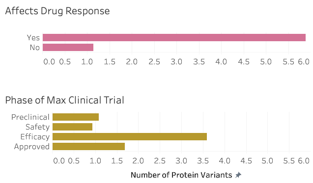

Module Goals

- Use spreadsheet software tools to explore, describe, and extract meaningful insights from tabular datasets
- Implement best practices in project design, scoping, and planning to successfully manage data science projects
- Develop frameworks for thinking about the business impact and ethical implications of their work with data

# Natural Protein Variants in Clinical Trial Failure

Found that proteins with a variant known to affect drug response have significantly higher variation. Determined that the average number of natural protein variants found in the protein targets is highest for drugs that failed in efficacy phases of clinical trials. 

Figure: Upper panel - average number of protein variants for proteins with a variant known to affect drug reponse (yes) or from proteins without a variant known to affect drug response (no). Lower panel - average number of protein variants in the protein target of drug that failed in pre-clinical, safety, efficacy phases or passed clinical trials. 

Tools used:
Google sheets, Tableau, pandas

Databases accessed: 
Uniprot, drug repurposing hub, clinvar

