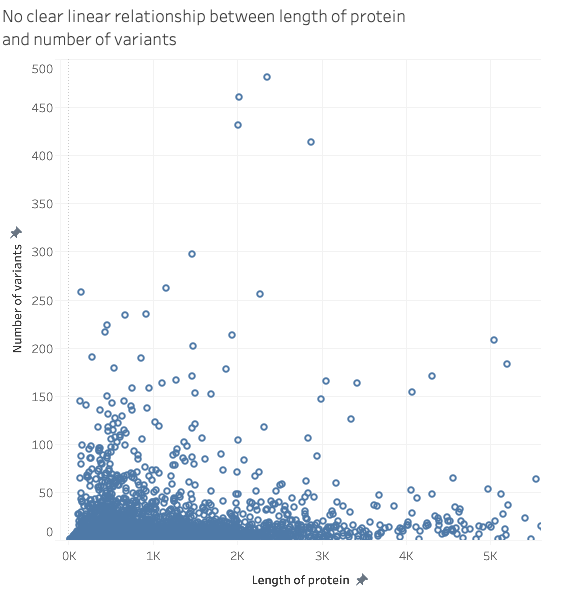

Metis Business Module

Emily Lorenzen

05/25/2021

# Minimum Viable Project

## Problem/Goal:
Natural variations in human protein arising from differences in the human genome are a cause of individual differences in response to medications. It is possible that these individual responses have led to drug failure in clinical trials. Schrodinger, a company that uses computational molecular modeling methods to identify candidate drugs, has recently started partnering with pharma companies to test candidate drugs in the preclinical and clinical trials. However, clinical trials are expensive and likely to fail. Pharma companies will be more interested partnerships if the candidate drug has already passed both the preclinical and safety clinical trials.  

## Impact 
Create new partnership with pharma companies, resulting in increased revenue. Reduce resources used within the company by focusing on drugs of most interest. 

## Impact hypothesis 
We can identify drugs that failed in clinical trials due to human protein variations by creating a model that predicts if a particular human variant affect interaction with the drug. 

## Solution paths
1. 

## Supporting visualization

